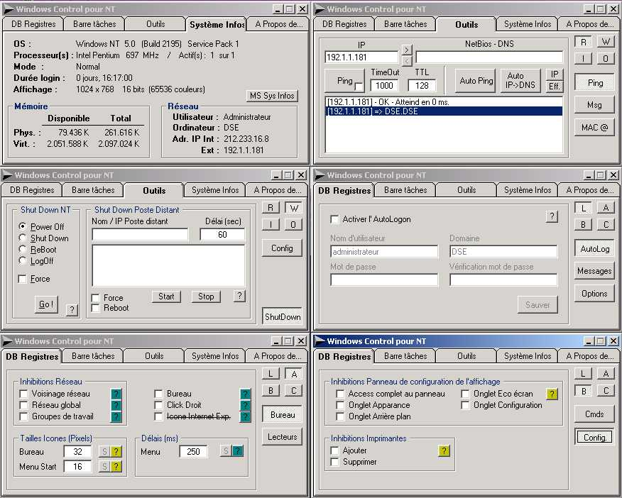



## WindowsControl for NT4 \(work on W2K\)

### Description

Tool intended for the administrators.

Two mains parts :

1) Windows secrets fonctionnalities.

Similar to the PolEdit program.

Useful to prevent a workman to modify Windows.

- Inhibe some commands like add printer,

change display properties, find, execute...

- Change icons size

- Hide some drive-letters from Explorer

- Apply an AutoLogin

- Show a message before the login

- Lock the NumLock before the login

- ...

All these changes can be made to a remote

computer (you must have admin rights !)

2) Network tools

- Ping an IP or DNS. Single or infinite with

sound to known the result without seeing the

screen !

- Convert IP->DNS and DNS->IP. This fonction

can be applied on a range of IP.

- Send messages (equivalent to 'net send' dos

command)

- See MAC address of all your NIC

- Shutdown the local or a remote computer

(equivalent to ShutDown.exe from the

zerotoolkit)

- Read data from the internet (UTC time for

exemple)

Thats all folk........ for the moment........

This code is usefull if you whish to learn :

- Registry manipulations

- WinAPI32

- Icontray (small icon near the clock)

- Retrieve system information (memory, display...)

- Network manipulations and tools

- ...

The program is in French and it miss a little

comments. If you have somes difficults to

understand the code or to translate, email me.

I made this program using many small codes and exemples found in PSC. Thanks to all of you that

take the time to upload your 'How to' exemples.
 
### More Info
 

             |
---                |---
**Submitted On**   |2001-11-20 09:42:00
**By**             |[SERRON Dominique](https://github.com/Planet-Source-Code/PSCIndex/blob/master/ByAuthor/serron-dominique.md)
**Level**          |Advanced
**User Rating**    |4.2 (21 globes from 5 users)
**Compatibility**  |VB 5\.0, VB 6\.0
**Category**       |[Complete Applications](https://github.com/Planet-Source-Code/PSCIndex/blob/master/ByCategory/complete-applications__1-27.md)
**World**          |[Visual Basic](https://github.com/Planet-Source-Code/PSCIndex/blob/master/ByWorld/visual-basic.md)
**Archive File**   |[WindowsCon4328712202001\.zip](https://github.com/Planet-Source-Code/serron-dominique-windowscontrol-for-nt4-work-on-w2k__1-29990/archive/master.zip)

